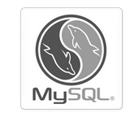
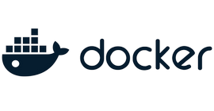
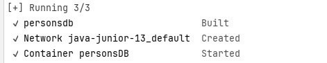
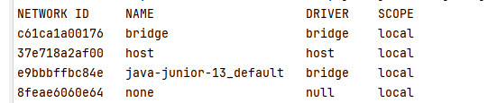
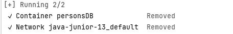
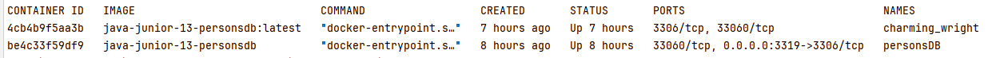
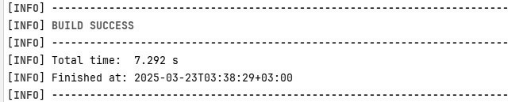
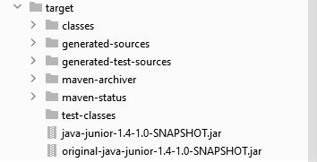

# Java Junior (семинары)
## Урок 4. Базы данных и инструменты взаимодействия с ними
### Задание: 
Настройте связь между вашим приложением и базой данных MySQL с использованием Hibernate. <br>
Создайте несколько объектов Person и сохраните их в базу данных.


<br><br><hr><hr>

### Общая информация


**Hibernate** позволяет абстрагироваться от написания **SQL-запросов** 
и управлять данными через объекты Java, используя возможности ORM.

**ORM (Object-Relational Mapping)** - это технология, 
позволяющая связывать объекты программного кода с таблицами 
в реляционной базе данных. 
Основная цель ORM - упростить работу с базами данных, 
избавив разработчика от необходимости писать SQL-запросы вручную. 
Вместо этого данные представляются в виде объектов, а манипуляции с ними осуществляются через методы этих объектов.
Использование ORM позволяет значительно ускорить процесс разработки приложений,
работающих с базами данных, особенно когда речь идет о сложных схемах данных и большом количестве таблиц.

Примеры ORM:
- **Hibernate** для Java,
- **Django ORM** для Python,
- **ActiveRecord** для Ruby on Rails,
- **Entity Framework** для C#/.NET.

#### Основные функции ORM:
1. **Отображение объектов на таблицы**. Классы и поля в программе сопоставляются с таблицами и столбцами в базе данных.
2. **Автоматическая генерация запросов**. ORM сам создает SQL-запросы на основе операций с объектами, что снижает вероятность ошибок и упрощает разработку.
3. **Управление транзакциями**. ORM обеспечивает поддержку транзакционного подхода к работе с данными.
4. **Кэширование**. Многие ORM поддерживают кэширование данных для повышения производительности.

#### MySQL и Hibernate

**Hibernate** - это ORM-фреймворк (Object-Relational Mapping),
который позволяет маппить объекты Java на таблицы в реляционной базе данных.
С помощью Hibernate программисту не нужно писать много SQL-кода
вручную - фреймворк автоматически генерирует запросы на основе настроенных классов-моделей и аннотаций.


**MySQL** - это одна из наиболее популярных реляционных баз данных с открытым исходным кодом. 
Она используется для хранения, управления и извлечения структурированных данных, организованных в таблицы. 
В Java-программах для взаимодействия с MySQL чаще всего используют JDBC-драйверы, 
которые позволяют отправлять SQL-запросы и получать результаты через 
стандартные интерфейсы `Connection`, `Statement` и `ResultSet`.


#### Взаимодействие MySQL с Hibernate

Для работы с базой данных MySQL через Hibernate в Java-приложении необходимо сделать определенные настройки.

1. **Настроить зависимости**: добавить в проект библиотеки Hibernate и драйвер MySQL (например, через Maven).

   ```
   <dependency>
       <groupId>org.hibernate</groupId>
       <artifactId>hibernate-core</artifactId>
       <version>5.6.10.Final</version>
   </dependency>
   <dependency>
       <groupId>mysql</groupId>
       <artifactId>mysql-connector-java</artifactId>
       <version>8.0.31</version>
   </dependency>
   ```

2. **Создать класс модели (Entity)**:

   ```
   import javax.persistence.Entity;
   import javax.persistence.Id;
   import javax.persistence.Table;

   @Entity
   @Table(name = "users")
   public class User {
       @Id
       private Long id;
       private String name;
       // геттеры и сеттеры
   }
   ```

3. **Конфигурация Hibernate**: создать файл конфигурации `hibernate.cfg.xml` или 
   использовать аннотации для настройки подключения к базе данных MySQL.

   ```
   <?xml version="1.0" encoding="UTF-8"?>
   <!DOCTYPE hibernate-configuration PUBLIC "-//Hibernate/Hibernate Configuration DTD 3.0//EN" "http://www.hibernate.org/dtd/hibernate-configuration-3.0.dtd">
   <hibernate-configuration>
       <session-factory>
           <!-- Настройки подключения -->
           <property name="connection.driver_class">com.mysql.cj.jdbc.Driver</property>
           <property name="connection.url">jdbc:mysql://localhost:3306/your_database_name?serverTimezone=UTC</property>
           <property name="connection.username">your_username</property>
           <property name="connection.password">your_password</property>
           <!-- Другие свойства -->
           <property name="dialect">org.hibernate.dialect.MySQLDialect</property>
           <property name="show_sql">true</property>
           <mapping class="com.example.User"/>
       </session-factory>
   </hibernate-configuration>
   ```

4. **Создание SessionFactory и работа с объектами**:

   ```
   import org.hibernate.Session;
   import org.hibernate.SessionFactory;
   import org.hibernate.boot.MetadataSources;
   import org.hibernate.boot.registry.StandardServiceRegistryBuilder;

   public class Main {
       public static void main(String[] args) {
           StandardServiceRegistry registry = new StandardServiceRegistryBuilder()
                   .configure("hibernate.cfg.xml").build();
           MetadataSources sources = new MetadataSources(registry);
           SessionFactory sessionFactory = sources.buildMetadata().buildSessionFactory();

           try (Session session = sessionFactory.openSession()) {
               session.beginTransaction();

               // Создание нового объекта
               User user = new User();
               user.setName("John Doe");
               session.save(user); // Сохранение объекта в базу данных

               // Получение объекта из базы данных
               User savedUser = session.get(User.class, 1L);
               System.out.println(savedUser.getName());

               session.getTransaction().commit(); // Фиксация транзакции
           } catch (Exception e) {
               e.printStackTrace();
           }
       }
   }
   ```

<br><br>

**SQL-запрос** - это команда, написанная на языке SQL, 
используемая для выполнения различных операций с данными в реляционной базе данных. 
Язык SQL поддерживается большинством современных СУБД, включая MySQL. 

#### Основные типы SQL-запросов

1. **SELECT** - выборка данных из одной или нескольких таблиц.

Пример:
```
-- Выбор всех полей из таблицы users
SELECT * FROM users;
```

Выбор конкретных полей:
```
-- Выбор только имени и возраста пользователей
SELECT name, age FROM users;
```

Фильтрация результатов с помощью условия:
```
-- Выбор пользователей старше 18 лет
SELECT name, age FROM users WHERE age > 18;
```

2. **INSERT INTO** - вставка новых записей в таблицу.

Пример:
```
-- Добавление нового пользователя в таблицу users
INSERT INTO users (name, age, email)
VALUES ('Иван Иванов', 25, 'ivan@example.com');
```

3. **UPDATE** - обновление существующих записей в таблице.

Пример:
```
-- Обновление возраста пользователя с именем 'Иван Иванов'
UPDATE users
SET age = 26
WHERE name = 'Иван Иванов';
```

4. **DELETE** - удаление записей из таблицы.

Пример:
```
-- Удаление всех пользователей младше 18 лет
DELETE FROM users
WHERE age < 18;
```

5. **CREATE TABLE** - создание новой таблицы в базе данных.

Пример:
```
-- Создание таблицы users с полями name, age и email
CREATE TABLE users (
    id INT AUTO_INCREMENT PRIMARY KEY,
    name VARCHAR(255),
    age INT,
    email VARCHAR(255)
);
```

6. **ALTER TABLE** - изменение структуры существующей таблицы.

Пример:
```
-- Добавление нового поля phone_number в таблицу users
ALTER TABLE users
ADD COLUMN phone_number VARCHAR(20);
```

Удаление существующего поля:
```
-- Удаление поля age из таблицы users
ALTER TABLE users
DROP COLUMN age;
```

7. **DROP TABLE** - удаление таблицы из базы данных.

Пример:
```
-- Полное удаление таблицы users
DROP TABLE users;
```

<br><br><hr><hr>

### Решение задания

<br><br>

Для решения задания потребуется настроить проект в IntelliJ IDEA Community Edition,
добавить необходимые зависимости. <br>

Открыть проект в редакторе кода, например, IntelliJ IDEA и запустить проект Maven.
Для этого требуется создать новый Maven-проект. <br>
В файле pom.xml добавить необходимые зависимости. <br>
Создать сущность - класс Person, который будет использоваться для отображения таблицы базы данных. <br>
Создать конфигурационный файл persistence.xml в папке src/main/resources/META-INF. <br>
Для настройки базы данных убедиться, что файл `persistence.xml` в директории `src/main/resources/META-INF`
содержит правильные настройки подключения к базе данных:

```
<property name="javax.persistence.jdbc.url" value="jdbc:mysql://localhost:3319/jpa_tutorial?serverTimezone=UTC"/>
<property name="javax.persistence.jdbc.user" value="root"/>
<property name="javax.persistence.jdbc.password" value="password"/>
```

Содержимое файла `persistence.xml`:

```
<?xml version="1.0" encoding="UTF-8"?>
<persistence version="3.0"
             xmlns="https://jakarta.ee/xml/ns/persistence"
             xmlns:xsi="http://www.w3.org/2001/XMLSchema-instance"
             xsi:schemaLocation="https://jakarta.ee/xml/ns/persistence https://jakarta.ee/xml/ns/persistence/persistence_3_0.xsd">
    <persistence-unit name="PersonPersistenceUnit" transaction-type="RESOURCE_LOCAL">
        <provider>org.hibernate.jpa.HibernatePersistenceProvider</provider>
        <class>org.example.task1.Person</class>
        <properties>
            <property name="jakarta.persistence.jdbc.url" value="jdbc:mysql://personsDB:3307/persons?characterEncoding=UTF-8"/>
            <property name="jakarta.persistence.jdbc.user" value="root"/>
            <property name="jakarta.persistence.jdbc.password" value="password"/>
            <property name="jakarta.persistence.jdbc.driver" value="com.mysql.cj.jdbc.Driver"/>
            <property name="hibernate.connection.characterEncoding" value="UTF-8"/>
            <property name="hibernate.connection.useUnicode" value="true"/>
            <property name="hibernate.connection.charSet" value="UTF-8"/>
            <property name="hibernate.dialect" value="org.hibernate.dialect.MySQLDialect"/>
            <property name="hibernate.hbm2ddl.auto" value="update"/>
            <property name="hibernate.show_sql" value="true"/>
            <property name="hibernate.format_sql" value="true"/>
        </properties>
    </persistence-unit>
</persistence>

```

<br><br>

  

### Запуск контейнера для базы данных

1. **Установить Docker и Docker Compose**:
   - Убедиться, что установлены [Docker](https://www.docker.com/) и [Docker Compose](https://docs.docker.com/compose/) или скачать их с официальных сайтов, следуя инструкциям по установке.
   - Убедиться, что установлен [Docker Desktop](https://docs.docker.com/get-started/get-docker/)


2. Для запуска Docker-контейнера с базой данных MySQL и необходимыми параметрами,
   нужно подготовить несколько файлов: <br>
- файл `docker-compose.yml` для упрощенного запуска нескольких контейнеров вместе и <br>.
- файл `Dockerfile` для описания образа контейнера.


#### Файл `docker-compose.yml`

Разместить файл `docker-compose.yml` необходимо в корневой директории проекта.

```
# version: '3'
services:
  # Определяем службу для контейнера с MySQL
  personsdb:
    build: .  # Используется локально созданный Dockerfile
    container_name: personsDB  # Название контейнера
    ports:
      - "3319:3306"  # Привязка порта 3319 на хосте к порту 3306 внутри контейнера
    environment:
      - MYSQL_ROOT_PASSWORD=""  # Пароль для root
    volumes:
      - ./data:/var/lib/mysql  # Директория data для хранения данных вне контейнера
```

#### Файл `Dockerfile`

Необходимо разместить файл `Dockerfile` в той же корневой директории, в корневой папке проекта.

```
# Базовый образ
FROM mysql:latest

# Переменная окружения с паролем для root
ENV MYSQL_ROOT_PASSWORD=""

# Порт 3306 для MySQL
EXPOSE 3306

```

3. **Создать файл `docker-compose.yml`**:
   - В корневой директории проекта создать файл `docker-compose.yml` и добавить настройки контейнера для базы данных:
    
```
        services:
          java_app:
            build: .
            depends_on:
              - personsDB
            environment:
              - JAVA_TOOL_OPTIONS=-Dfile.encoding=UTF8
            networks:
              - app-network
            stdin_open: true
            tty: true
        
        
          personsDB:
            image: mysql:8.0
            container_name: personsDB
            ports:
              - "3307:3306"  # Изменение порта на хосте с 3306 на 3307
            environment:
              MYSQL_ROOT_USER: root
              MYSQL_ROOT_PASSWORD: password
              MYSQL_DATABASE: persons
            volumes:
              - mysql_data:/var/lib/mysql
            networks:
              - app-network
        
        volumes:
          mysql_data:
        
        networks:
          app-network:
            driver: bridge


```

4. **Создать файл `Dockerfile`**:
   - В той же директории создать файл `Dockerfile` и добавить в него базовые (исходные) настройки для работы базы данных mysql:
```
        FROM maven:3.9.9-eclipse-temurin-22 AS build
        WORKDIR /app
        COPY pom.xml .
        COPY src ./src
        RUN apt-get update && apt-get install -y iputils-ping
        RUN mvn clean package -DskipTests
        
        FROM openjdk:22-jdk-slim
        WORKDIR /app
        COPY --from=build /app/target/*.jar app.jar
        ENTRYPOINT ["java", "-jar", "/app/app.jar"]
```

<br><br>

5. Далее необходимо запустить [Docker Desktop](https://docs.docker.com/get-started/get-docker/)
   или проверить, что установленный и запущенный на компьютере, Docker работает нормально. <br>

6. Чтобы собрать проект Maven или пересобрать его с обновленными данными, в терминале из корня проекта запустить команду:
```bash
    mvn clean package  
```



7. **Запуск контейнера**:
   - Открыть терминал и перейти в директорию, где находятся файлы `docker-compose.yml` и `Dockerfile`.
   - Выполнить команду:
     ```bash
     docker-compose up --build
     ```
   Эта команда создаст и запустит контейнер для базы данных MySQL на порту 3319.


8. **Запуск программы**
    - Проверить id запущеного контейнера с приложением java_app:
   ```bash
        docker-compose ps
    ```
    - Выполнить команду:
        ```bash
        docker attach <container id>
        ```
     Эта команда создаст и запустит контейнер для консольного приложения и подключит к базе данных MySQL.

<br><br>

## Инструкция

<hr><br><br>

### Команды для работы с контейнером

<br>

- **Запуск контейнера**:
  ```bash
  docker-compose up -d
  ```


- **Проверка состояния контейнера, список контейнеров**:
  ```bash
  docker-compose ps
  ```
- **Проверка конфигурации Docker**:
  ```bash
  docker ps
  ```

- **Проверка сетевых настроек Docker**:
 ```bash
  docker inspect <container_id>
  ```
Соответствие IP-адреса Docker-контейнеру, можно
проверить с помощью команды, например, `docker inspect personsDB`



- **Проверка сетевых настроек**:

Убедиться, что Docker использует нужную сеть, что контейнеры находятся в одной сети,
можно с помощью команды:
 ```bash
  docker network ls
  ```

- **Проверка статуса Docker**:

Убедиться, что Docker работает правильно и
предоставляет информацию о системе можно с командой
 ```bash
  docker info
  ```
- **Проверка логов контейнера**:
 ```bash
  docker logs <container_id>
  ```
Проверить логи контейнера на наличие дополнительных сообщений об ошибках
можно, например, с помощью команды `docker logs personsDB`

- **Очистите кэш Docker**:
 ```bash
  docker builder prune
  ```

- **Остановка контейнера**:
  ```bash
  docker-compose down
  ```



- **Составить список контейнеров**:
  Составить список всех запущенных и остановленных контейнеров можно командой:
     ```bash
     docker ps -a
     ```
   <br><br>

- **Удалить конфликтующий контейнер**:
  Удалить контейнер, например, `personsDB`, можно командой:
     ```bash
     docker rm personsDB
     ```
- **Остановка контейнера**
  Если контейнер запущен, требоваться сначала остановить его:
  ```bash
  docker stop personsDB
  docker rm personsDB
  ```

<br><br>


### Необходимые настройки JDK

1. **Проверка установленной версии JDK**:
   - Проверить, что установлена версия JDK, которая соответствует указанной в `pom.xml`. Для [Java 22](https://www.oracle.com/java/technologies/javase/jdk22-archive-downloads.html) вам нужно установить JDK 22.
   - Или можно скачать [JDK 22](https://jdk.java.net/java-se-ri/22) с официального сайта [Oracle](https://www.oracle.com/) или использовать [OpenJDK](https://openjdk.org/).

2. **Настройка переменной окружения `JAVA_HOME`**:
   - Убедиться, что переменная окружения `JAVA_HOME` указывает на правильную версию JDK.
   - Например, если JDK 22 установлен в `C:\Program Files\Java\jdk-22`, установить `JAVA_HOME` на этот путь.

3. **Обновление `pom.xml`**:
   - Убедиться, что в `pom.xml` указаны правильные версии для `maven.compiler.source` и `maven.compiler.target`.
   - Если нет JDK 22, можно изменить версию на установленную, например, 17:

   ```
   <properties>
       <maven.compiler.source>17</maven.compiler.source>
       <maven.compiler.target>17</maven.compiler.target>
   </properties>
   ```
<br>


### Необходимые настройки Maven

1. **Установить Maven**:
   - Убедиться, что Maven установлен на компьютере.
   - Или можно скачать и установить Maven с официального сайта [Apache Maven](https://maven.apache.org/download.cgi).

2. **Переменные окружения**:
   - Убедиться, что путь к Maven добавлен в переменную окружения `PATH`. Это позволяет выполнять команду `mvn` из любой директории.
   - **Добавить Maven в PATH на Windows**:
      1. Найти папку, где установлен Maven, например, `C:\apache-maven-3.9.9\bin`.
      2. Открыть "Панель управления" -> "Система и безопасность" -> "Система" -> "Дополнительные параметры системы".
      3. Нажать "Переменные среды" и добавить путь к Maven в переменную `PATH`.

3. **Проверка установки**:
   - После установки и настройки переменных окружения открыть новый терминал или командную строку и выполнить команду:
     ```bash
     mvn -v
     ```
   Эта команда должна вывести версию Maven, если он установлен правильно. <br><br>
     <br><br>
   - После изменения переменных окружения необходимо перезапустить терминал, <br>редактор кода или командную строку, чтобы изменения вступили в силу.

После указанных действий можно успешно выполнить команду `mvn clean package`.

<br><br><br><br>


### Установка Docker Desktop for Windows

По умолчанию Docker Desktop for Windows устанавливается на диске C:\. <br> 
Но если требуется установка на другой диск, можно выполнить установку с помощью скрипта. <br> 
Открыть командную строку от имени администратора (щелкнуть правой кнопкой мыши на значке терминала и выберите "Запуск от имени администратора").  <br>
Если используется терминал Windows, проверить, что используется командная строка, а не Powershell, <br>
так как есть различия в командах. <br>
Перейти в папку, в которую был загружен "Docker Desktop Installer.exe". <br>
Запустить в консоли скрипт: 
```
start /w "" "Docker Desktop Installer.exe" install -accept-license  --installation-dir=E:\Docker\docker-desktop
```  
Программа установки не создаст каталог "Docker", если не указать каталог после буквы драйвера. <br>
Обязательно написать директорию, например,  <br>
`E:\Docker\docker-desktop` как минимум одну папку для распаковки программы.

<br><br>

## Сборка и запуск приложение
<hr><br>

1. **Запуск Docker Desktop**
   - Убедиться, что docker запущен на компьютере, например, в [Docker Desktop](https://docs.docker.com/desktop/).<br><br>

2. **Сборка проекта**:
   - Сборка проекта выполняется командой `mvn clean package`
   - Или командой `mvn clean package -DskipTests`

    <br><br>

   В папке target/ должен появится готовый JAR-файл.

   <br><br>

3. **Запуск контейнеров**:
   - Запустить контейнеры требуется с помощью Docker Compose (пересборка контейнера с JAR) командой:
     ```bash
     docker-compose up --build
     ```
     Приложение должно быть собрано и запущено в Docker-контейнерах.
     Будет использоваться база данных MySQL, доступная на порту `3319`на хосте localhost.

4. **Запускать контейнер интерактивно**:
   ```sh
   docker-compose run java_app      
   ```  
   или
  ```bash
    docker run -it java-junior-13-app
  ```
    или

```bash
     docker-compose run --rm java_app
     
```

5. **Если контейнер уже работает, войти внутрь и запустить Java-приложение**:
   ```sh
   docker exec -it java_app /bin/sh
   java -jar /app/app.jar
   ```
6. **Перезапустить без `-d`**:
   ```sh
   docker-compose down
   docker-compose up
   ```


<br><br><hr><hr>


<hr><hr><br><br>